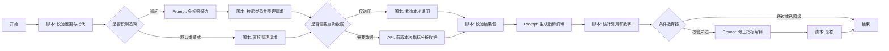

# 重定价缺口率 AI 工作流平台迁移规格

## 1. 目标和边界

本文面向熟悉行内 AI 工作流平台、准备按图复刻的同事，不是新手逐步教程，也不是交给 IT 部署的说明。打开本地 `/workflow` 的行内复刻图，对照节点类型、连线、输入输出和关键配置。LangGraph 编译拓扑不在页面上展示，由 `GET /v1/canvas-spec` 与测试核对。

当前可复刻的是**单指标基线编排**。输入指标范围和问题，经受限分类后调用一个已注册的 ALM 指标分析 API，只把本次相关的小结果包交给模型。没有正式 API、权限和平台试运行结果时，不能声称已完成无缝迁移。

当前样例只用于验证编排。**正式重定价缺口率、期限权重、限额、重要币种和三层 Owen 归因均以 ALM 后端为准**，不可使用 `analysis.py` 的虚构数值与五因素演示算法上线。

## 2. 开始节点契约

| 参数 | 类型 | 必填 | 说明 |
| --- | --- | --- | --- |
| `orgCode/currencyCode/tenorCode/asOfDate` | String | 是 | 页面机构、币种、期限、图中最新实际数据日。指标固定在本工作流内 |
| `frequency` | String | 否 | MONTH 或 DAY，默认 MONTH；同一数据源的展示频率 |
| `question` | String | 否 | 空值表示打开 AI 后的默认概览 |
| `options` | Object | 否 | 页面明确选择的 baseDate/businessType/nodeCode/focusCurrencyCode/comparedCurrencies；analysisMode/dataNeeds 可用于定向调试，正常自动识别，不需逐项填写 |
| `sessionId` | 平台内置 | 否 | 标识会话；不作为指标 API 条件，不自动替代状态恢复配置 |

正式接口必须根据当前登录身份重新鉴权，不能只信开始节点传入的机构或币种。API Key 和服务令牌由平台/网关管理，不作为开始节点入参。

`chatHistory` 是平台系统变量，不配置为开始字段；上下文脚本的 `history` 输入直接引用它。开始节点整体引用已行内实测可用。页面筛选条件仍需调用方传入，开始节点不会自行读取页面。

## 3. 节点画布

| 节点 | 平台节点类型 | 输入与输出 | 失败处理 |
| --- | --- | --- | --- |
| 开始 | 开始 | 六项常规字段和可选 options，平台内置 `systemInput` | 无效输入在下一脚本中断 |
| 校验范围与整理指代 | 脚本 | input 引用整个开始；history 引用系统 chatHistory；输出 preparationOutput | 无效范围中断；历史损坏或缺少指代时澄清 |
| 是否识别追问 | 条件选择器 | 首次默认或显式类型跳过，其他追问走识别 | 不额外增加开始参数 |
| 直接整理本轮请求 | 脚本 | 默认或显式请求转为 contextOutput | 不调用识别模型 |
| 识别追问的分析类型 | Prompt | 八类0/1候选、主要类型、是否需澄清；输出 intentRaw | 异常空输出交脚本澄清，不回退关键词 |
| 校验类型并整理请求 | 脚本 | 校验候选后生成 analysisMode/dataNeeds，机构日期等仍取精确上下文 | 不确定、业务对象不清、超过四类均不取数 |
| 是否需要查询数据 | 条件选择器 | needsData 为 true 走 API，否则走本地说明 | 不猜测用户意图 |
| 构造本地说明 | 脚本 | 与 API 同形响应，只有澄清或不支持状态 | 不访问业务数据 |
| 获取本次指标分析数据 | API | 一个已注册、固定地址的 ALM API，按 `dataNeeds` 一次返回小结果 | 无正式 API 时无法上线 |
| 校验结果包 | 脚本 | 对齐范围、版本、数据状态和体积 | 不一致则中断，不调用模型 |
| 生成指标解释 | Prompt | `qwen3.8-27b`，文本输出 JSON 字符串 | 异常忽略后的空值行为待实测 |
| 核对引用和数字 | 脚本 | 解析 JSON，核对引用与数值 | 不通过交给条件选择器 |
| 是否修正文案 | 条件选择器 | validationErrors 非空 | 前向分支，无回边 |
| 修正指标解释 | Prompt | 带差异清单再生成 | 异常忽略后空值待实测 |
| 复核引用和数字 | 脚本 | 同一套校验 | 仍失败则 `narrative=null` |
| 结束 | 结束 | 结果包、文案、校验/降级标记 | Object/null/Array 输出待实测 |

逐节点的**具体配置和值**以 `/workflow` 的“复刻配置”视图为准，事实源是 `metrics/repricing_gap/blueprint.spec.json`，`platform_blueprint.py` 只做适配。输出校验脚本由本地共用的规则打包为单个 `handler(params)`；两次校验均须传 `analysisMode`，首次 `isRetry=false`，复核 `isRetry=true`。修正 Prompt 引用 `previousErrors`，复核仍失败才返回 `LIVE_MODEL_OUTPUT_INVALID`。平台文档规定脚本节点超时 5 秒、不支持 HTTP/文件 I/O；正式指标计算、Owen 归因和明细匹配必须在 ALM API 内完成。基线先不启用流式和中间信息输出，实际帧行为须现场试运行。

本地图已按 `AI编排/行内平台契约.md` 展开为前向 DAG，装配期禁止回边。行内仍需实测条件选择器合流、空文案和 Array 输出，不能无缝导入。

## 4. ALM API 数据要求

一个固定重定价缺口率接口，十项请求字段：`orgCode`、`currencies`（一维字符串数组，单币种一项，比较两项）、`tenorCode`、`asOfDate`、`frequency`、`analysisMode`、`dataNeeds`，以及按需的 `baseDate/businessType/nodeCode`。`analysisMode` 是主要类型；`dataNeeds` 是自动生成的一维字符串清单，包含主要类型，最多四类，不含澄清。后三项只在清单包含对应分析时使用。基期空值或 PREVIOUS 由后端按频率选上一可比期；明确日期不存在则拒绝，不替换。不接收页面币种、会话状态、原始问题、日期全集或澄清原因。兼容旧请求：缺少 dataNeeds 时视为只请求 analysisMode。

单一分析保留已有响应形状。复合分析使用 `body.analyses.<类型>`，每项独立带状态、实际范围、数据日期与版本；共同使用同一个当期和比较基期。两币种比较附带趋势或归因时，这些模块的 `byCurrency` 数组分别承载两个币种的结果，不把其中一个的原因套到另一个。公共 `status=available` 表示组合包可交付，不表示所有模块都可用；各模块的 `status` 必须逐项处理。无比较基期只使归因/业务部分 unavailable，不影响趋势和限额。总包仍不超过 16000 字符，超范围明确拒绝，不偷偷截掉问题。

文案每类独立一节，两币种各写一节；引用路径例如 `analyses.limit.limit.headroomPctPoint`、`analyses.attribution.changePctPoint`。输出校验检查所有请求项是否得到回答，且引用实质证据；只引用 status 而不回答可用分析也不算通过。正式后端仍须逐币种授权、保持各模块同一数据与口径版本，不由模型承担计算。

统一返回 `returnCode/errorCode/body`；`body` 带实际 `scope`、`analysisMode`、`actualDataDate`、`dataVersion`、`caliberVersion`、`status`。机构确定的默认口径由后端应用并返回；当前试点非默认口径在本地明确返回不支持，不送默认 API。将来支持多个口径时需扩展契约，不能静默套用默认口径。正式鉴权必须覆盖本轮全部币种。

| 能力 | 必要字段 | 默认裁剪 |
| --- | --- | --- |
| 概览 | 当期值、限额、短趋势、必要币种摘要、基期与主要变动因素 | 当前最多 6 个趋势点；嵌套 attribution 保留贡献勾稽，不返回明细 |
| 限额 | 当期值、适用限额、超限或剩余空间 | 不返回趋势、币种全集或归因 |
| 趋势 | 有界历史序列 | 当前最多 12 个月频点或 31 个日频点，不返回限额、币种全集或归因 |
| 币种比较 | 指定两种币种的摘要 | 不返回未请求币种；占比仍按机构原分母计算，不在两币种间重新归一 |
| 计算过程 | `nodeCode`、当前节点取值、公式/运算符、直接子节点 | 每次只返回下一层，不传完整树 |
| 归因 | 基期、当期、各因素值、影响值、合计残差、归因方法版本 | 模型仅接收影响最大的因素与必要抵消项，完整表留在服务端 |
| 业务证据 | 类别汇总、变动类型、脱敏明细引用；正式归因影响由正式后端提供 | 当前最多 10 条示例记录；分页追问待扩展，明细不充当正式归因 |
| 口径 | 指标定义、适用范围、排除规则、版本与引用 | 只取当前问题涉及条目 |

正式归因须采用页面当前口径的三层嵌套 Owen 结果，且与页面指标时点、币种、期限、资产分类及限额筛选保持一致。明细只说明业务变化线索，除非 ALM 后端给出经过验证的逐笔归因，否则不能声称“该笔业务贡献多少个百分点”。

## 5. 会话与权限

开启平台会话历史，关闭 Prompt 自动上下文注入。2026-10-08 行内实测：`chatHistory` 为数组，每项含 `inputMessage`、`outputMessage` 两个 JSON 字符串；只记录每轮输入及结束输出，未自动记录脚本中间标记。当前问题独立传入。

结束模板保留 `conversationState`，含 businessType/focusCurrencyCode/comparedCurrencies/baseDate/scopeKey；页面展示 narrative，不把状态拼入正文。上下文脚本只解析最新历史项的 outputMessage，支持直接输出对象及 `res` 外层，提取并校验状态。历史正文、旧业务数据不进入 Prompt/API；不把 chatHistory 再次嵌入结束输出，避免递归膨胀。最新输出损坏或缺状态时先澄清，不回退更早历史；首次空数组使用页面条件，无法确定的指代要求澄清。页面范围变化清空旧状态，本轮明确条件优先于旧状态。

本地服务以同样的字符串格式保存最近 20 轮开始入参及最终输出，用 sessionId 恢复；20 轮是本地上限，不代表行内默认。旧本地客户端传 conversationState 仍可兼容，但它不在行内开始表单中。正式 OpenAPI 复用 sessionId 后是否自动注入相同历史、保存轮数及结束历史设置仍需联调。每轮重新查询授权数据，历史状态不能作为权限依据。

## 6. 输出与验收

最终输出沿用 `server.py` 的 `analysisMode/resultPackage/narrative/degradeFlags/validationErrors/conversationState/sessionId`。`narrative` 包含 `headline`、`sections[].text`、`sections[].citations` 与 `numericRefs[]`。引用路径必须能回填到同版本结果包；模型正文新增的数字也要被校验。模型失败时 `narrative=null`，前端仍渲染确定性数据。

复刻完成后，对照 `tests/test_workflow.py` 至少验证：默认概览、限额、趋势、逐级计算、正式归因勾稽、业务原因、口径、权限拒绝、缺数与不适用、错误数字拦截、模型故障降级、多轮追问及中间信息输出顺序。行内平台上的 API 复杂 Object 入参、JSON 输出与中间信息输出组合需实际验证；平台文档在复杂 Object 入参描述上存在前后不一致，不能仅凭文档假定兼容。
