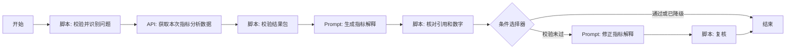

# 重定价缺口率 AI 工作流平台迁移规格

## 1. 目标和边界

本文面向熟悉行内 AI 工作流平台、准备按图复刻的同事，不是新手逐步教程，也不是交给 IT 部署的说明。打开本地 `/workflow` 的行内复刻图，对照节点类型、连线、输入输出和关键配置。LangGraph 编译拓扑不在页面上展示，由 `GET /v1/canvas-spec` 与测试核对。

当前可复刻的是**单指标基线编排**。输入指标范围和问题，经受限分类后调用一个已注册的 ALM 指标分析 API，只把本次相关的小结果包交给模型。没有正式 API、权限和平台试运行结果时，不能声称已完成无缝迁移。

当前样例只用于验证编排。**正式重定价缺口率、期限权重、限额、重要币种和三层 Owen 归因均以 ALM 后端为准**，不可使用 `analysis.py` 的虚构数值与五因素演示算法上线。

## 2. 开始节点契约

| 参数 | 类型 | 必填 | 说明 |
| --- | --- | --- | --- |
| `metricCode/orgCode/currencyCode/tenorCode/asOfDate` | String | 是 | 扁平输入；绕开 API 节点复杂 Object 入参的文档歧义 |
| `question` | String | 否 | 空值表示打开 AI 后的默认概览 |
| `analysisMode` | String | 否 | 推荐问题可直接指定 `overview/limit/trend/calculation/attribution/business/methodology`；未识别问法为 `clarification`，不得默默改成概览 |
| `baseDate` | String | 否 | 比较基期；缺省上一个可用时点，正式默认规则由 ALM 返回 |
| `nodeCode` | String | 否 | 计算过程逐级展开的节点编码 |
| `businessType` | String | 否 | 业务类别编码；正式接口应使用稳定编码而非中文名称 |
| `sessionId` | 平台内置 | 否 | 基线不依赖历史上下文；多轮追问后续在平台实测 |

正式接口必须根据当前登录身份重新鉴权，不能只信开始节点传入的机构或币种。API Key 和服务令牌由平台/网关管理，不作为开始节点入参。

## 3. 节点画布

| 节点 | 平台节点类型 | 输入与输出 | 失败处理 |
| --- | --- | --- | --- |
| 开始 | 开始 | 扁平输入字段，平台内置 `systemInput` | 无效输入在下一脚本中断 |
| 校验并识别问题 | 脚本 | 校验范围、输出受限 `analysisMode` | 不识别时走概览 |
| 获取本次指标分析数据 | API | 一个已注册、固定地址的 ALM API，按 `analysisMode` 返回小包 | 无正式 API 时无法上线 |
| 校验结果包 | 脚本 | 对齐范围、版本、数据状态和体积 | 不一致则中断，不调用模型 |
| 生成指标解释 | Prompt | `qwen3.8-27b`，文本输出 JSON 字符串 | 异常忽略后的空值行为待实测 |
| 核对引用和数字 | 脚本 | 解析 JSON，核对引用与数值 | 不通过交给条件选择器 |
| 是否修正文案 | 条件选择器 | validationErrors 非空 | 前向分支，无回边 |
| 修正指标解释 | Prompt | 带差异清单再生成 | 异常忽略后空值待实测 |
| 复核引用和数字 | 脚本 | 同一套校验 | 仍失败则 `narrative=null` |
| 结束 | 结束 | 结果包、文案、校验/降级标记 | Object/null/Array 输出待实测 |

逐节点的**具体配置和值**以 `/workflow` 的“复刻配置”视图为准，数据源是 `platform_blueprint.py`。平台文档规定脚本节点超时 5 秒、不支持 HTTP/文件 I/O；正式指标计算、Owen 归因和明细匹配必须在 ALM API 内完成。基线先不启用流式和中间信息输出，因为平台文档说明 Prompt JSON 输出不支持逐 token 流式，实际帧行为须现场试运行。

本地图已按 `AI编排/行内平台契约.md` 展开为前向 DAG，装配期禁止回边。行内仍需实测条件选择器合流、空文案和 Array 输出，不能无缝导入。

## 4. ALM API 数据要求

一个固定指标分析接口接收扁平范围字段和受限 `analysisMode`，内部按模式调用 ALM 服务。统一返回 `returnCode/errorCode/body`；`body` 至少携带 `scope`、`actualDataDate`、`dataVersion`、`caliberVersion`、`status`。无数据与不适用必须显式区分。不能把截图、HTML、整张明细表或全量时间序列送入模型。本地 `/mock/analysis/query` 只是联调接口，不能直接注册到行内平台。

| 能力 | 必要字段 | 默认裁剪 |
| --- | --- | --- |
| 概览 | 指标值、单位、适用限额、限额方向、币种规模、最近时间点 | 趋势最多取相关的 12 至 24 期 |
| 计算过程 | `nodeCode`、当前节点取值、公式/运算符、直接子节点 | 每次只返回下一层，不传完整树 |
| 归因 | 基期、当期、各因素值、影响值、合计残差、归因方法版本 | 模型仅接收影响最大的因素与必要抵消项，完整表留在服务端 |
| 业务证据 | 类别汇总、正式归因影响、变动类型、脱敏明细引用 | 默认最多 10 条，必要时分页追问 |
| 口径 | 指标定义、适用范围、排除规则、版本与引用 | 只取当前问题涉及条目 |

正式归因须采用页面当前口径的三层嵌套 Owen 结果，且与页面指标时点、币种、期限、资产分类及限额筛选保持一致。明细只说明业务变化线索，除非 ALM 后端给出经过验证的逐笔归因，否则不能声称“该笔业务贡献多少个百分点”。

## 5. 会话与权限

基线关闭 Prompt 上下文管理，避免旧数据混入本次回答。多轮追问如需代词识别，后续只保存最近分析类型、业务类别、比较基期等少量字段；每轮重新取当前授权数据，不复用旧结果包。明细权限由 ALM 服务按当前用户、字段和行数核验，平台 API Key 只代表服务身份。

## 6. 输出与验收

最终输出沿用 `server.py` 的 `analysisMode/resultPackage/narrative/degradeFlags/validationErrors/sessionId`。`narrative` 包含 `headline`、`sections[].text`、`sections[].citations` 与 `numericRefs[]`。引用路径必须能回填到同版本结果包；模型正文新增的数字也要被校验。模型失败时 `narrative=null`，前端仍渲染确定性数据。

复刻完成后，对照 `tests/test_workflow.py` 至少验证：默认概览、限额、趋势、逐级计算、正式归因勾稽、业务原因、口径、权限拒绝、缺数与不适用、错误数字拦截、模型故障降级、多轮追问及中间信息输出顺序。行内平台上的 API 复杂 Object 入参、JSON 输出与中间信息输出组合需实际验证；平台文档在复杂 Object 入参描述上存在前后不一致，不能仅凭文档假定兼容。
